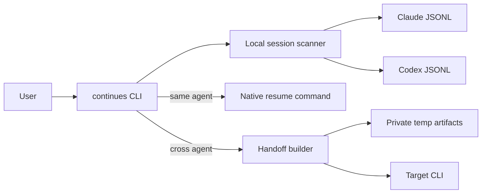

# continues-cli

Resume local Claude Code and Codex sessions, or transfer enough context to
continue the work in the other CLI.

`continues` reads the session files already stored on your machine. A same-agent
resume delegates to that agent's native resume command. A cross-agent transfer
builds a compact handoff and starts a new session in the target CLI.

The runtime is written in strict TypeScript and compiled to standard Node.js
ES modules before packaging.

## Requirements

- Node.js 22 or newer
- Claude Code, Codex CLI, or both
- Local session history from the source CLI

## Install

Install from a local checkout:

```bash
git clone https://github.com/danishaft/resume-cli-.git
cd resume-cli-
npm install
npm link
```

The package exposes both `continues` and the legacy `bridge` alias.

## Use

Run without arguments to choose from recent Claude Code and Codex sessions:

```bash
continues
```

Resume a known session in its original CLI:

```bash
continues resume <session-id>
```

List sessions from one source:

```bash
continues list --source codex --limit 10
```

Transfer a Codex session to Claude Code:

```bash
continues resume <session-id> --from codex --in claude
```

Inspect a launch without running it:

```bash
continues resume <session-id> --from codex --dry-run
```

Forward arguments after `--`:

```bash
continues resume <session-id> -- --model gpt-5
```

Run `continues --help` for every option.

## How it works



Session scanning reads JSONL incrementally. It sorts candidates by filesystem
modification time before parsing metadata, which avoids loading every complete
conversation. Same-agent resumes use `claude --resume <id>` or
`codex resume <id>`.

Cross-agent transfers normalize recent messages, extract working state, and
write the full artifacts to a mode `0700` temporary directory with mode `0600`
files. The target receives a bounded handoff prompt, not the source session
file.

See [system.md](system.md) for component boundaries, execution sequences, and
failure behavior.

## Privacy

The CLI reads local conversation history. Cross-agent transfer can place recent
conversation text in:

- the target agent prompt;
- private files under the operating system temporary directory;
- `.continues-handoff.md` when `--write-local` is explicitly set.

Review sensitive sessions before transferring them between tools.

## Development

```bash
npm install
npm run build
npm run check
npm pack --dry-run
```

`npm run check` runs Biome, the strict TypeScript build, and the focused
argument and native-command contract tests. Listing a real local session and
inspecting its dry-run launch are the functional smoke checks.

## Limitations

- Session discovery depends on the current local JSONL formats used by Claude
  Code and Codex.
- Cross-agent handoffs summarize recent context; they cannot recreate private
  runtime state held inside the source process.
- Windows paths and terminal interaction have not been verified.

## License

[MIT](LICENSE)
