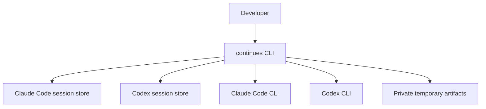
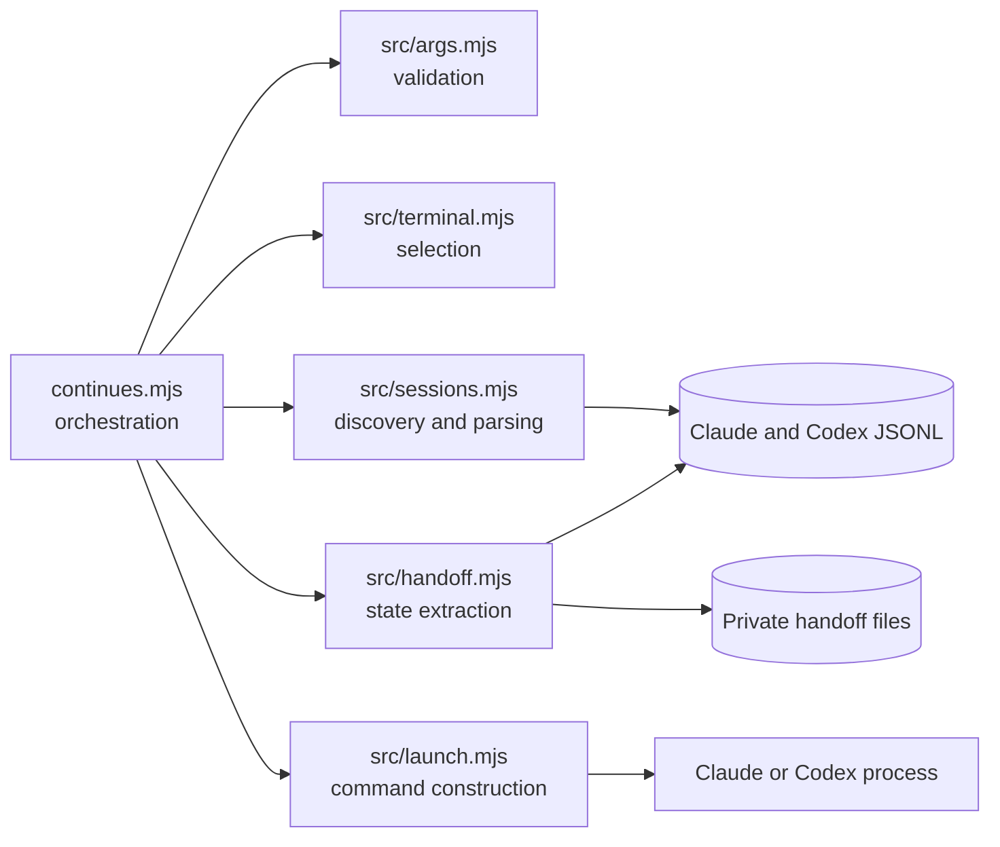
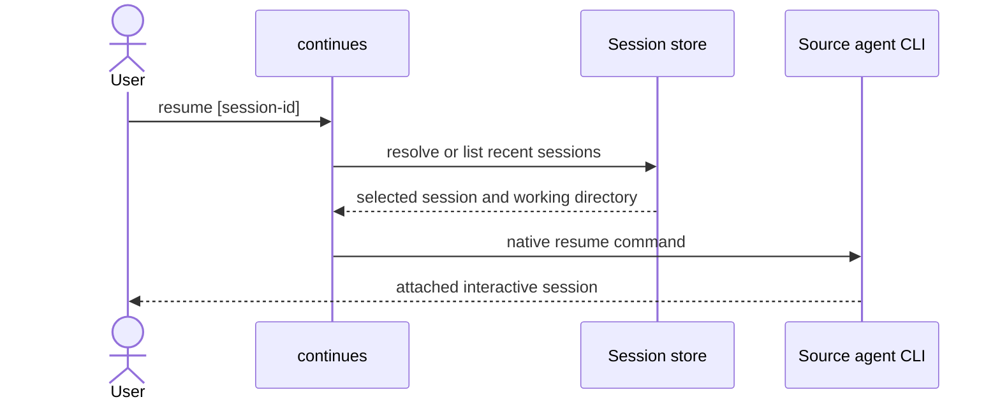
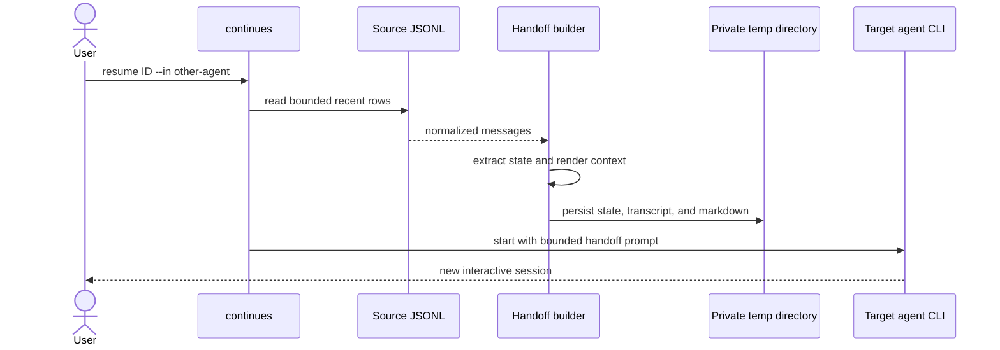

# System design

continues-cli is a local process. It has no server, database, or background
daemon. The design keeps source-specific parsing separate from command
selection and process launch.

## System context

The user owns every boundary. The CLI only reads local agent stores, writes
handoff files for cross-agent transfers, and starts an installed target CLI.

## Components

`continues.mjs` owns the workflow but not implementation details. Argument
validation returns explicit command shapes. Session parsing converts each
source format into a common conversation shape. Launch code is the only module
that knows native CLI syntax.

## Same-agent resume

No handoff is generated. Delegating to native resume preserves the agent's own
session semantics and avoids maintaining a second resume protocol.

## Cross-agent transfer

The transfer is intentionally a new target session. Session identifiers are
private to their source agent and are not interchangeable.

## Data and privacy

Discovery scans:

- `~/.claude/projects/**/*.jsonl`
- `~/.codex/sessions/**/*.jsonl`

Metadata reads stop after enough head rows are available. Conversation reads
retain only a bounded tail. Cross-agent artifacts are stored under
`$TMPDIR/continues-handoffs` with restrictive Unix permissions.

The CLI does not redact conversation content because reliable generic
redaction would create false confidence. Transfer is an explicit user action,
and the README describes where content is sent and stored.

## Failure behavior

Invalid arguments fail before filesystem access. Missing or ambiguous sessions
produce explicit errors. A source and target process with a non-zero exit code
causes the CLI to fail rather than report success.

Malformed JSONL rows are skipped so one partial write does not hide all other
sessions. A missing session root behaves as an empty source, which supports
machines with only one agent installed.

## Design decisions

- Use native resume commands for same-agent work.
- Parse JSONL as streams instead of loading complete histories.
- Keep source adapters local until a third format proves a reusable interface
  is necessary.
- Bound handoff context and persist complete artifacts separately.
- Avoid a daemon, network protocol, or database because the workflow is a
  single local command.

## Verification boundary

Automated tests protect parsing options and native command construction. A
functional smoke check lists a real local session and inspects the exact dry-run
launch. Live cross-agent behavior still depends on installed third-party CLIs
and their session formats.
